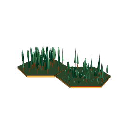
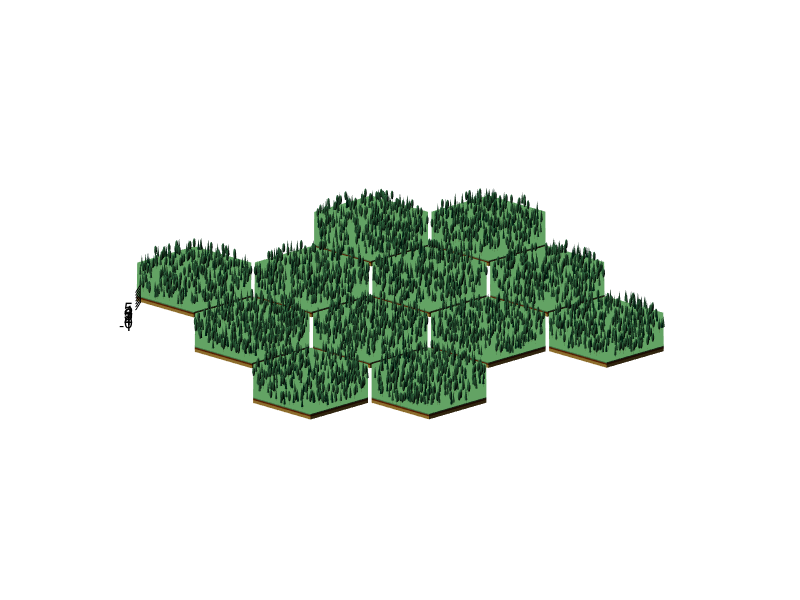
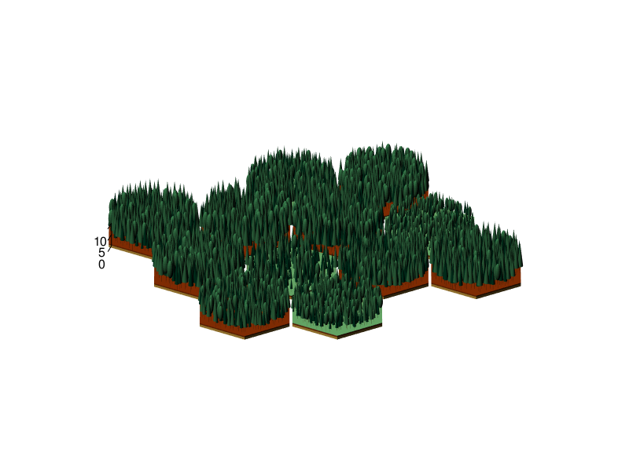
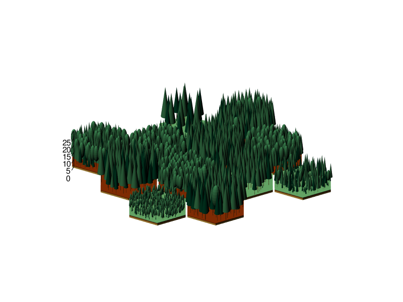
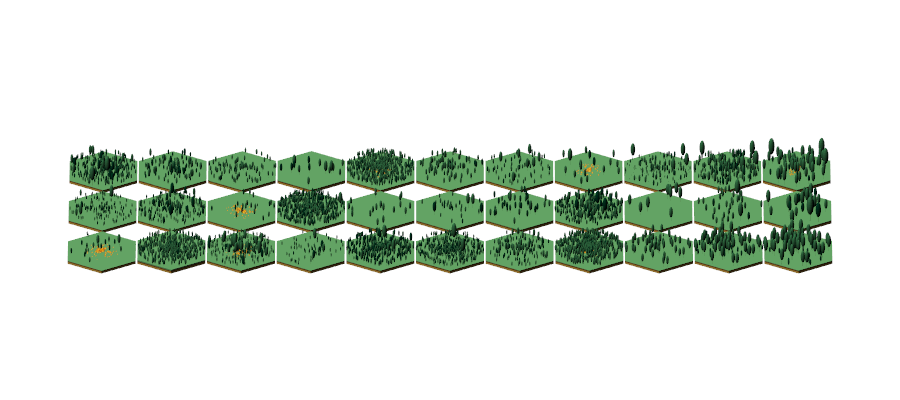

This package renders the vegetation structure of individual and cohort based dynamic (global) vegetation models (DGVM) with gap dynamic. Here I present how to derive the required data with the DGVM [LPJ-GUESS](http://iis4.nateko.lu.se/lpj-guess/) [@smith_representation_2001; @smith_implications_2014].

# Code to be part of an external DGVM

So far LPJ-GUESS is the only model included.

## C++ code to include in LPJ-GUESS

LPJ-GUESS is hirarchically organized in stands, which contain a certain number of patches, where the vegetation grows. The default output is averaged over those patches, to represent different successional states of vegetation per coarse gridpoint. This library here needs the output of each patch, therefore an additional output module is needed.

To create the required output table in LPJ-GUESS, which is written in C++ a new output module needs to be registered. In the source code the following header and code files need to be placed in the 'modules' subdirectory of the LPJ-GUESS source code. And they have to be added in the CMakeList.txt file at the appropriate position. The files are also located in the R site-library, which can be accessed via `system.file(paste0("lpj/modules/vegstructoutput.", c("h", "cpp")), package="DGVM3D")`.

```{r engine='Rcpp', eval=FALSE}
///////////////////////////////////////////////////////////////////////////////////////
/// \file vegstructoutput.h
/// \brief Output module for patch based vegetation structure
///
/// \author Joerg Steinkamp
/// $Date: Thu Nov  3 11:15:37 CET 2016 $
///
///////////////////////////////////////////////////////////////////////////////////////
#ifndef LPJ_GUESS_VEGSTRUCT_OUTPUT_H
#define LPJ_GUESS_VEGSTRUCT_OUTPUT_H
#include "outputmodule.h"
#include "outputchannel.h"
#include "gutil.h"
namespace GuessOutput {
  class VegstructOutput : public OutputModule {
  public:
    VegstructOutput();
    ~VegstructOutput();
    // implemented functions inherited from OutputModule
    // (see documentation in OutputModule)
    void init();
    void outannual(Gridcell& gridcell);
    void outdaily(Gridcell& gridcell);
  private:
    xtring file_vegstruct;
    FILE *out_vegstruct;
  };
}
#endif
```

```{r engine='Rcpp', eval=FALSE}
///////////////////////////////////////////////////////////////////////////////////////
/// \file vegstructoutput.cpp
/// \brief Output module for patch based vegetation structure
///
/// \author Joerg Steinkamp
/// $Date: Thu Nov  3 11:15:37 CET 2016 $
///
///////////////////////////////////////////////////////////////////////////////////////
#include "config.h"
#include "vegstructoutput.h"
#include "parameters.h"
#include "guess.h"
namespace GuessOutput {
    REGISTER_OUTPUT_MODULE("vegstruct", VegstructOutput)
    VegstructOutput::VegstructOutput() {
    declare_parameter("file_vegstruct", &file_vegstruct, 300, "Detailed vegetation structure");
  }
  VegstructOutput::~VegstructOutput() {
  }
  void VegstructOutput::init() {
    if (file_vegstruct != "") {
      std::string full_path = (char*) file_vegstruct;
      out_vegstruct = fopen(full_path.c_str(), "w");
      if (out_vegstruct == NULL) {
        fail("Could not open %s for output\n"                         \
             "Close the file if it is open in another application",
             full_path.c_str());
      } else {
        dprintf("dummy\n");
        fprintf(out_vegstruct, "Lon Lat Year SID PID VID Pft Lifeform LeafType PhenType Pathway Age LAI ShadeType N DBH Height Crownarea\n");
      }
    }
  }
  void VegstructOutput::outdaily(Gridcell& gridcell) {
    return;
  }
  void VegstructOutput::outannual(Gridcell& gridcell) {
    if (file_vegstruct == "")
      return;
    if (date.year >= nyear_spinup-50) {
      double lon = gridcell.get_lon();
      double lat = gridcell.get_lat();
      Gridcell::iterator gc_itr = gridcell.begin();
      while (gc_itr != gridcell.end()) {
        Stand& stand = *gc_itr;
        stand.firstobj();
        while (stand.isobj) {
          Patch& patch = stand.getobj();
          Vegetation& vegetation = patch.vegetation;
          vegetation.firstobj();
          while (vegetation.isobj) {
            Individual& indiv=vegetation.getobj();
            // guess2008 - alive check added
            if (indiv.id != -1 && indiv.alive) {
              fprintf(out_vegstruct, "%7.2f %6.2f %4i ", lon, lat, date.get_calendar_year() );
              fprintf(out_vegstruct, " %i ",    stand.id);
              fprintf(out_vegstruct, " %i ",    patch.id);
              fprintf(out_vegstruct, " %i ",    indiv.id);
              fprintf(out_vegstruct, " %10s ",  (char*) indiv.pft.name);
              fprintf(out_vegstruct, " %i ",    indiv.pft.lifeform);
              fprintf(out_vegstruct, " %i ",    indiv.pft.leafphysiognomy);
              fprintf(out_vegstruct, " %i ",    indiv.pft.phenology);
              fprintf(out_vegstruct, " %i ",    indiv.pft.pathway);
              fprintf(out_vegstruct, " %4.0f ", indiv.age);
              fprintf(out_vegstruct, " %6.2f ", indiv.lai);
              if (indiv.pft.lifeform == TREE) {
                fprintf(out_vegstruct, " %4.1f ", indiv.pft.alphar);
                fprintf(out_vegstruct, " %4.0f ", indiv.densindiv * patcharea);
                fprintf(out_vegstruct, " %7.2f ", pow(indiv.height/indiv.pft.k_allom2,1.0/indiv.pft.k_allom3));
                fprintf(out_vegstruct, " %8.2f ", indiv.height);
                fprintf(out_vegstruct, " %8.2f ", indiv.crownarea);
              } else if (indiv.pft.lifeform == GRASS) {
                fprintf(out_vegstruct, " %4.1f ", -1.0);
                fprintf(out_vegstruct, " %i ",     1);
                fprintf(out_vegstruct, " %i ",    -1);
                fprintf(out_vegstruct, " %i ",    -1);
                fprintf(out_vegstruct, " %i ",    -1);
              }
              fprintf(out_vegstruct, "\n");
            }
            vegetation.nextobj();
          }
          stand.nextobj();
        }
        ++gc_itr;
      }
    }
  } // END of void VegStructOutput::outannual
} // END of namespace VegStructOutput

```

The code writes the following output columns including a header line, if the parameter `file_vestruct` is defined in the instruction file.

| Column name | Type      | Description |
|:------------|:---------:|:-------------------------------------------------|
| Lon         | numeric   | longitude  |
| Lat         | numeric   | latitude |
| Year        | integer   | year |
| SID         | integer   | Stand ID |
| PID         | integer   | Patch ID |
| VID         | integer   | Vegetation ID; the ID of a cohort or individuum |
| Pft         | character | Name of the PFT/Species as defined in the guess instruction file |
| Lifeform    | integer   | value of Pft lifeform (enum {NOLIFEFORM, TREE, GRASS}) |
| LeafType    | integer   | value of Pft leafphysiognomy (enum {NOLEAFTYPE, NEEDLELEAF, BROADLEAF}) |
| PhenType    | integer   | value of Pft phenology (enum {NOPHENOLOGY, EVERGREEN, RAINGREEN, SUMMERGREEN, CROPGREEN, ANY}) |
| Pathway     | integer   | value of Pft pathway (enum {NOPATHWAY, C3, C4}) |
| Age         | integer   | value of cohort age |
| LAI         | numeric   | value of cohort leaf area index |
| ShadeType   | numeric   | value of cohort alphar as a measure for shade tolerance class. Is ranked in the package. |
| N           | integer   | number of individual per cohort. In individual mode this is 1. |
| DBH         | numeric   | individual tree diameter (equal for all members of the same cohort) |
| Height      | numeric   | individual height |
| Crownarea   | numeric   | individual crown area |

So far not all of those values are used in the code. However, they seemed to be useful in the future. Do not run LPJ-GUESS with too many gridpoints with the above output module. This will create hundreds of GB or even TB of output! An example dataset ('dgvm3d.succession') is included in this package. However, to save disk space it includes data for every fifth year only.

# DGVM3D workflow

## Global options

When the library is loaded a few global default options are set to reduce the number of function parameters passed through several cascading function calls. These options can be modified by `dgvm3d.options`.

| Name | Value | Function |
|------|-------|-----------------------------------------------------------|
| patch.area | 1000 | The area of one patch in m^2 |
| samples | c(10, 10) | [1] Number of samples to determin next tree position; [2] max. repetition if no suitable position is found |
| overlap | 0.5 | fraction of crownradii to overlap with nearest neighbour during establishment |
| sort.column | c("Crownarea", "descending") | Determine the position for the largest trees first, then fill the gaps |
| establish.method | "random" | How to choose from the above sample for the next tree position ('random', 'min' or 'max' distance) |
| beta.parameters | c(1.1, 0.9) | shape parameters for beta random value to determine the distance from the patch center |
| color.column | "ShadeType" | which data column to use for the canopy color |
| verbose | TRUE | print some messages |

## Importing the data

For very large output files I recommend writing an extra input function using data.table, which is way faster than the default data.frames.

### From LPJ-GUESS

The function `read.LPJ` reads the above output if the output and extend cohorts to `N` average individuals, which will be rendered in varying shapes and colors based on the other attributes. If LPJ-GUESS was run at several locations, it is recommended to read the gridlist first, and create a list of data.frames. In this example below every fifth year after 1859 is selected for the given locations.

```{r, eval=FALSE}
dgvm3d.locations = read.table("gridlist.txt",
                              col.names=c("Lon", "Lat", "Name"), sep="\t",
                              stringsAsFactors=FALSE)
dgvm3d.succession=list()
for (i in 1:nrow(dgvm3d.locations)) {
  dgvm3d.succession[[dgvm3d.locations$Name[i]]] =
  read.LPJ("vegstruct.out",
           lon=dgvm3d.locations$Lon[i],
           lat=dgvm3d.locations$Lat[i])
  dgvm3d.succession[[i]] = dgvm3d.succession[[i]][!(dgvm3d.succession[[i]]$Year %% 5) &
                                                  dgvm3d.succession[[i]]$Year > 1859, ]
}
```

### Other models

Please write and contibute your own input function.

## Layout

For visualization each patch in a stand is represented by a hexagon with an individual number of soil layers as well as variable height. However, the patch size is equal for all patches.

```{r, message=FALSE}
library(DGVM3D)
stand = initStand()
stand3D(stand)
snapshot3d("stand_1x1.png")
```


## Establish the individual trees

The individual trees are by default randomly distributed within the inner radius of each patch hexagon with `establishTrees`. The returned data.frame should is the put into the respective vegetation slot of a patch of a stand.

## Visualisation

`stand3D` renders the soil hexagons in a rgl window and `plant3D` renders the trees planted with `establishTrees`.

```{r, message=FALSE}
stand = initStand(npatch=2)
stand3D(stand, 1)
veg = data.frame(DBH=rep(0.4, 50))
veg$Height    = veg$DBH * 35
veg$Crownarea = veg$DBH * 5
veg$LeafType  = sample(1:2, nrow(veg), replace=TRUE)
veg$ShadeType = sample(1:2, nrow(veg), replace=TRUE)
veg$LAI = rep(2, nrow(veg))
veg = rbind(veg, data.frame(DBH=-1, Height=-1, Crownarea=-1, LeafType=-1, ShadeType=3, LAI=0.5))
stand@patches[[1]]@vegetation = establishTrees(veg, stand@hexagon@supp[['inner.radius']])
stand = plant3D(stand)

stand3D(stand, 2)
veg = data.frame(DBH=rep(0.5, 100) * rgamma(100, 2.5, 9))
veg$Height    = veg$DBH * 35  * rbeta(nrow(veg),10,1)
veg$Crownarea = veg$DBH * 5 * rnorm(nrow(veg), 1, 0.1)
veg$LeafType  = sample(1:2, nrow(veg), replace=TRUE)
veg$ShadeType = sample(1:2, nrow(veg), replace=TRUE)
veg$LAI = rep(2, nrow(veg))
veg = rbind(veg, data.frame(DBH=-1, Height=-1, Crownarea=-1, LeafType=-1, ShadeType=-1, LAI=1.5))
stand@patches[[2]]@vegetation = establishTrees(veg, stand@hexagon@supp[['inner.radius']])
stand = plant3D(stand, 2)
snapshot3d("stand_1x2.png")
```


## Overview Applications

With the function `snapshot` the trees present at the given year and for the given patches will be rendered. The function `succession` keeps the trees with the maximum distance to the nearest neighbour for each cohort at their position and those trees growing too close together are removed, when the number of individuums decreases. New trees are randomly distributed with the desired method. The removal of killed individuals is done in the function `updateStand`, which calls `establishTrees` with the next years vegetation data.frame to distribute new tree saplings.

## Temporal snapshots and their application

The succession is often visualized with the Leaf area index (LAI). Starting with grasses in the beginning, then early successional trees (shade intolerant) and later on the late successional trees (shade tolerant). Due to the random component in establishment, mortality and patch distroying disturbance the indivudual patches look quiet chaotic with a low number of repeated patches. However, if averaged over all patches, which is normally done, the expected successional pattern emerges. Allthough still not very smooth here, since we have only 12 patches. Normally a simulation should have at least 50 or better 100 patches (see `demo(dgvm3d.ggsuccession)`).

```{r, message=FALSE}
location <- 'Canada - boreal forest'
for (y in c(1865, 1915, 2005)) {
  open3d(windowRect=c(0, 0, 800, 600), scale=c(1, 1, 1), FOV=0)
  par3d(skipRedraw=TRUE)
  stand = snapshot(dgvm3d.succession[[location]], year=y)
  par3d(skipRedraw=FALSE)
  rgl.clear("lights")
  rgl.light( theta = -25, phi = 30, specular = "black", diffuse = "#FFFFFF")
  axis3d("z", pos=c(-stand@hexagon@supp$outer.radius, 5*stand@hexagon@supp$inner.radius, NA))
  rot.z = rotationMatrix(pi/6, 0, 0, 1)
  rot.y = rotationMatrix(-pi/3, 1, 0, 0)
  rgl.viewpoint(userMatrix = rot.y %*% rot.z, fov=1)
  rgl.snapshot(paste0("snapshot_", y, ".png"))
}
```
In the beginning the patches look very homogen.

However, already after 40 years they grow higher and start to differentiate.

And after 140 years, the patches look very heterogen, they are dominated by different tree types and exhibit an individual age structure (height).


### Succession and fire

If we look at another location (Sahel), we get a grass dominated landscape, where the trees can't really establish beyond the sapling size and with several years of high fire probability.

```{r, message=FALSE}
location <- "Africa - sahel"
dummy = open3d(windowRect=c(0, 0, 900, 400), scale=c(1, 1, 1), FOV=1)
stand = succession(dgvm3d.succession[[location]], patch.id = c(2, 8, 10), init.year = 1860, years = seq(1905, 2005, 10))
stand3D(stand)
par3d(skipRedraw=TRUE)
stand = plant3D(stand)
fire3D(stand, limit=0.2)
par3d(skipRedraw=FALSE)
rgl.clear("lights")
rgl.light( theta = -25, phi = 30, specular = "black", diffuse = "#FFFFFF")
rot.z = rotationMatrix(-pi/2, 0, 0, 1)
rot.y = rotationMatrix(-pi/3, 1, 0, 0)
rgl.viewpoint(userMatrix = rot.y %*% rot.z, fov=1.5, zoom = 0.5)
rgl.snapshot("succession.png")
```


### Rotating Animation

The `demo('dgvm3d.animation')` contains an example with a snapshot of all 12 patches, starting in 1860 rotating around the central z-axis and every 50 frames the year is incremented. *Be carefull* this takes several minutes. It also includes commented out code to save all pictures, label them and convert them to MP4.

# References
